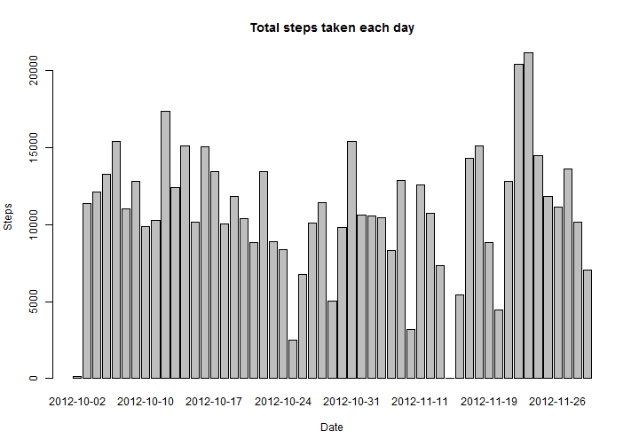
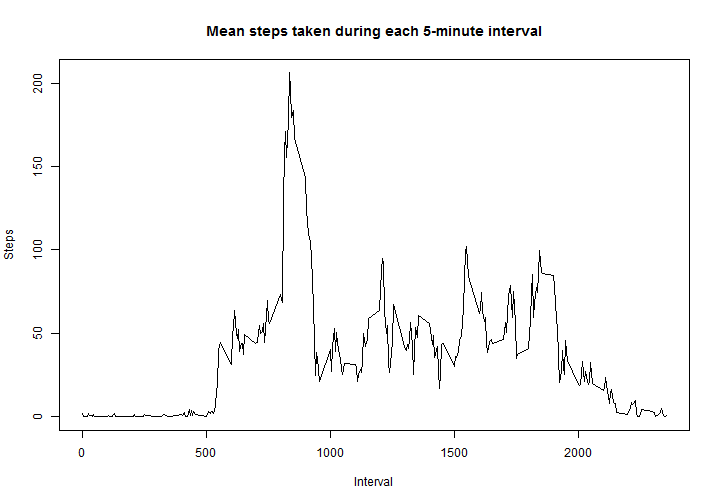
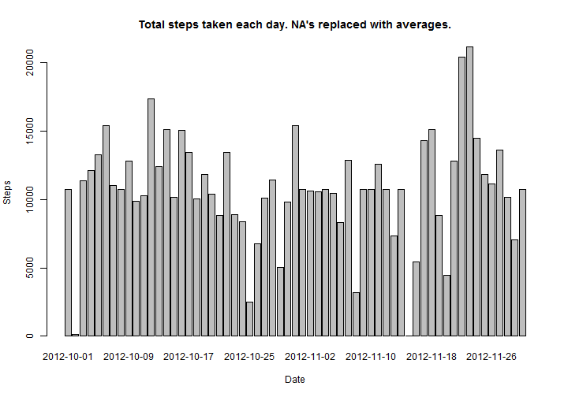
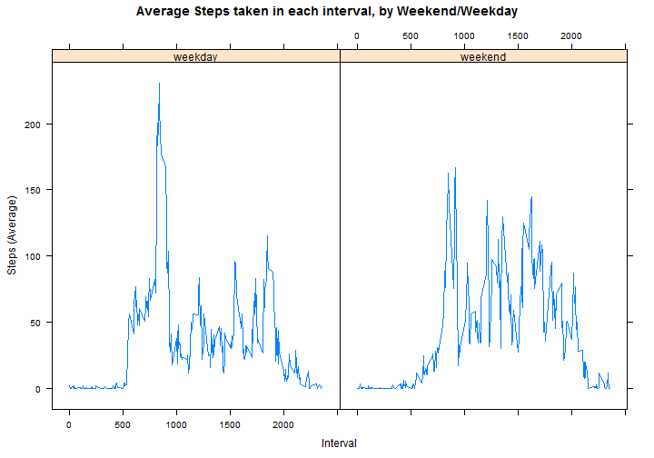

# Reproducible Research: Peer Assessment 1
### Student: Michael Graef

## Loading and preprocessing the data
Assumes the data is in the working directory in zipped format.  
Unzip data and read into variable 'activity'

```r
fn <- "activity.zip"
unzip(fn)

activity <- read.table("activity.csv", sep = ",", header = TRUE, stringsAsFactors = FALSE)
```


## What is mean total number of steps taken per day?
### Create table 'stepsbydate' which contains the total steps taken for each day.  
Ignore NA's for now.

```r
stepsbydate <- aggregate(steps ~ date, data = activity, sum, na.action = na.omit)
```


### Plot the total number of steps taken each day.

```r
barplot(stepsbydate$steps, main = "Total steps taken each day", ylab = "Steps", 
    xlab = "Date", names.arg = stepsbydate$date)
```

 


### Calculate mean & median steps taken per day.
Ignore NA's for now.

```r
meansteps <- mean(stepsbydate$steps)
mediansteps <- median(stepsbydate$steps)
```


Mean steps taken per day is 1.0766 &times; 10<sup>4</sup>.  
Median steps taken per day is 10765.  


## What is the average daily activity pattern?
### Create table 'stepsbyinterval' which contains the mean steps taken in each interval across all days.  
Ignore NA's for now.

```r
stepsbyinterval <- aggregate(steps ~ interval, data = activity, mean, na.action = na.omit)
```


### Plot the mean steps taken in each interval

```r
plot(stepsbyinterval$interval, stepsbyinterval$steps, type = "l", main = "Mean steps taken during each 5-minute interval", 
    ylab = "Steps", xlab = "Interval")
```

 


### Find the interval with the maximum average number of steps

```r
maxsteps <- max(stepsbyinterval$steps)
maxstepsinterval <- stepsbyinterval[stepsbyinterval$steps == maxsteps, 1]
```


Maximum average steps is 206.1698 which occurs in interval 835.

## Imputing missing values
### Find the NA's in the original activity dataset.  Count the number of occurrences.

```r
activityNA <- activity[is.na(activity$steps), ]
activityNAcount <- nrow(activityNA)
```


Number of rows in activity.csv with NA values for steps is 2304.

### Impute missing values in activity
Use the average number of steps by interval (i.e. for all missing values, use the value from the corresponding interval in table 'stepsbyinterval', calculated above, containing mean values)  
Build a new activity table with these values

```r
newactivity <- activity
for (i in 1:nrow(newactivity)) {
    if (is.na(newactivity[i, "steps"])) {
        newactivity[i, "steps"] <- stepsbyinterval[stepsbyinterval$interval == 
            newactivity[i, "interval"], ]$steps
    }
}
```


### Create table 'stepsbydate' which contains the total steps taken for each day.  

```r
newstepsbydate <- aggregate(steps ~ date, data = newactivity, sum)
```


### Plot the total number of steps taken each day.

```r
barplot(newstepsbydate$steps, main = "Total steps taken each day. NA's replaced with averages.", 
    ylab = "Steps", xlab = "Date", names.arg = newstepsbydate$date)
```

 


### Calculate mean & median steps taken per day.

```r
newmeansteps <- mean(newstepsbydate$steps)
newmediansteps <- median(newstepsbydate$steps)
```


Mean steps taken per day is 1.0766 &times; 10<sup>4</sup>. (using imputed values for NA's)  
Median steps taken per day is 1.0766 &times; 10<sup>4</sup>.  (using imputed values for NA's)

### Calculate change in mean & median steps between original and new activity datasets

```r
changemean <- newmeansteps - meansteps
changemedian = newmediansteps - mediansteps
```

Mean steps before NA's replaced of 1.0766 &times; 10<sup>4</sup> changed by 0 to 1.0766 &times; 10<sup>4</sup>.  
Median steps before NA's replaced of 10765 changed by 1.1887 to 1.0766 &times; 10<sup>4</sup>.

*Because of the method used to impute the missing values, and because missing values were for complete days, all days with missing values received the same number of steps.  This kept the mean exactly the same for the old & new datasets.*  


## Are there differences in activity patterns between weekdays and weekends?
### Create a new factor variable with two levels to differentiate between weekends and weekdays

```r
dayofweek <- ifelse(weekdays(as.POSIXct(newactivity$date)) %in% c("Saturday", 
    "Sunday"), "weekend", "weekday")
newactivity <- cbind(newactivity, dayofweek)
```


### Create table which contains the average steps taken for each type of day (weekend/weekday). 

```r
stepsbyintervaldow <- aggregate(steps ~ interval + dayofweek, data = newactivity, 
    mean)
```


### Build panel plot to compare weekend and weekday steps by interval

```r
library(lattice)
xyplot(steps ~ interval | dayofweek, data = stepsbyintervaldow, type = "l", 
    main = "Average Steps taken in each interval, by Weekend/Weekday", xlab = "Interval", 
    ylab = "Steps (Average)")
```

 


